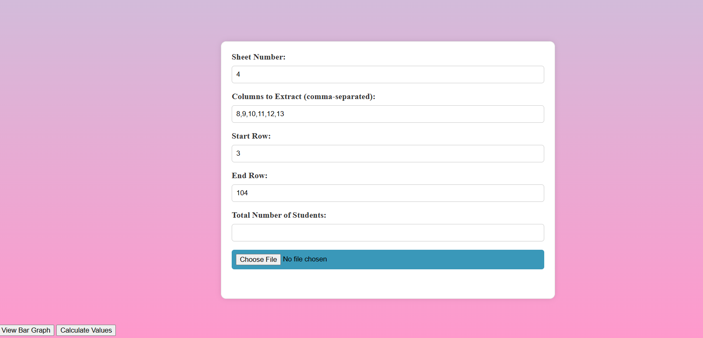
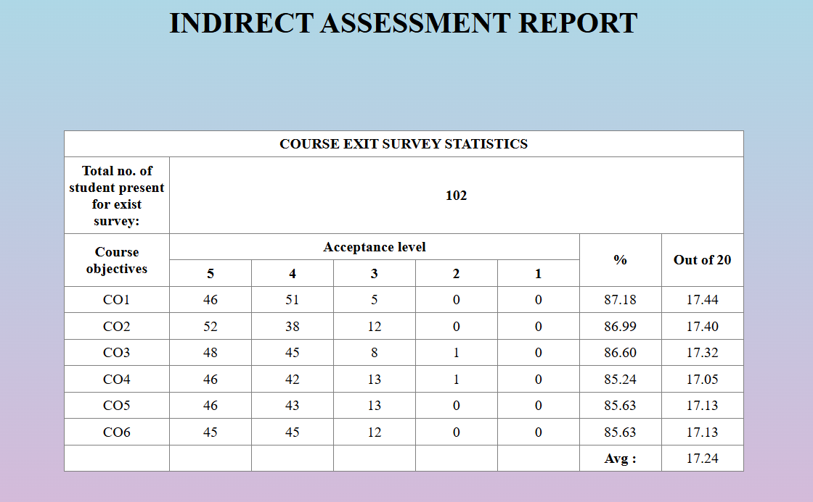
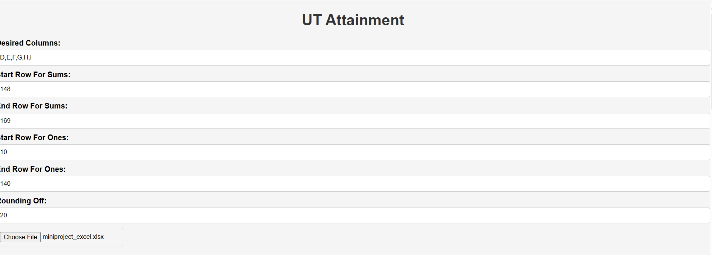
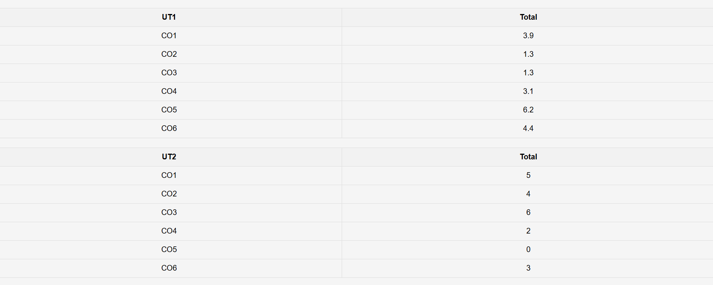
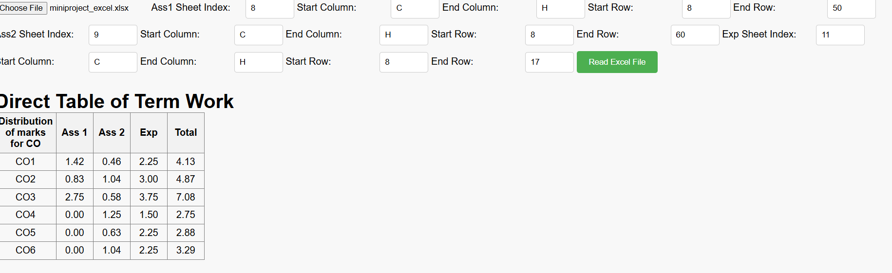
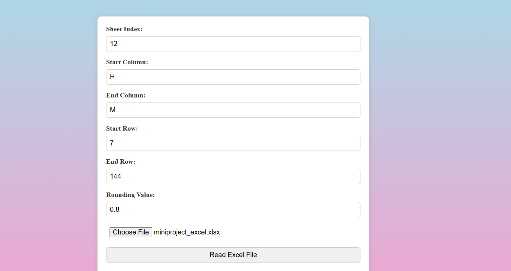
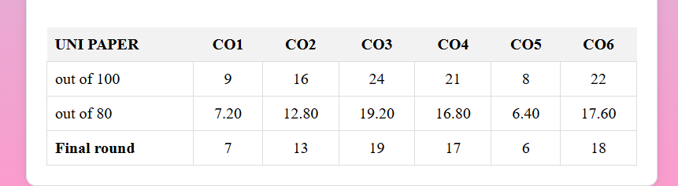

# 🧮 Attainment Calculator

A web-based tool to help educational institutions evaluate and calculate **Course Outcome (CO)** attainment based on students' academic performance.

---

## ✅ Our Project Working

### 🎯 Purpose

The **Attainment Calculator** assists faculty in computing attainment levels using data from Unit Tests, Term Work, University Exams, and Indirect feedback. It simplifies the overall process, ensuring accuracy and saving time.

---
# Problem Statement

In educational institutions, accurately assessing and tracking student performance across various components (such as Unit Tests, Term Work, University Exams, and Indirect Feedback) is essential for determining **Course Outcome (CO) attainment**. However, manually calculating these values can be cumbersome and error-prone, especially when dealing with large amounts of student data.

Current systems may not offer a straightforward way for faculty to compute CO attainment quickly and efficiently. Moreover, a lack of a unified platform often leads to inconsistencies in assessment and difficulty in tracking student progress over time.

---

## Objective:

The objective of the **Attainment Calculator** is to create a web-based application that helps faculty members easily compute CO attainment based on the student's performance in various academic components. The tool aims to:

1. **Automate** the calculation of COs for Unit Tests, Term Work, University Exams, and Indirect Feedback.
2. Provide a **centralized system** for assessing student attainment, reducing human error.
3. **Display results clearly** with easy navigation, ensuring a user-friendly interface for faculty members.

## ⚙️ Working Process

### 1. User Interface (UI)
- Designed with **HTML, CSS, and JavaScript**
- Simple, clean layout with navigation bar and action buttons
- Responsive styling and intuitive interaction

### 2. Modular Structure
The main dashboard links to several key modules:
- 🔹 `Indirect Attainment` – Gathers feedback-based CO evaluation
- 🔹 `Unit Test Total` – Calculates CO attainment from UT performance
- 🔹 `Term Work` – Evaluates internal work submissions
- 🔹 `University Average` – Computes average performance in final exams

### 3. Individual Functional Pages
Each module is a separate HTML page:
- Faculty enters student marks or responses
- COs are mapped to each question or task
- Calculations are done using basic logic and formulas

### 4. CO Mapping Logic
- Questions are mapped to relevant Course Outcomes (COs)
- Marks obtained per question are used to calculate CO attainment levels

### 5. Final Attainment Calculation
- Combines results from:
  - Unit Tests
  - Term Work
  - University Exams
  - Indirect Feedback
- Uses a weighted average formula to calculate final attainment for each CO

### 6. User-Friendly Design
- Color-coded buttons
- Attractive background and bold font styling
- Easy to navigate and understand

---

## 🛠️ Technologies Used

- **Frontend**: HTML, CSS, JavaScript

---

## 📁 Project Files

- `index.html` – Main landing page with navigation
- `UnitTest (updated).html` – Unit Test CO calculator
- `termwork.html` – Term Work input and processing
- `UniversityUpdatedCss.html` – University result analysis
- `indirectFlexible.html` – Indirect CO feedback module

## Screenshots
## Home Page

## Indirect Assessment 

## Indirect Assessment result

## UT Assessment

## UT Assessment result

## Term Work Assessment

## University Assessment

## University Assessment result

